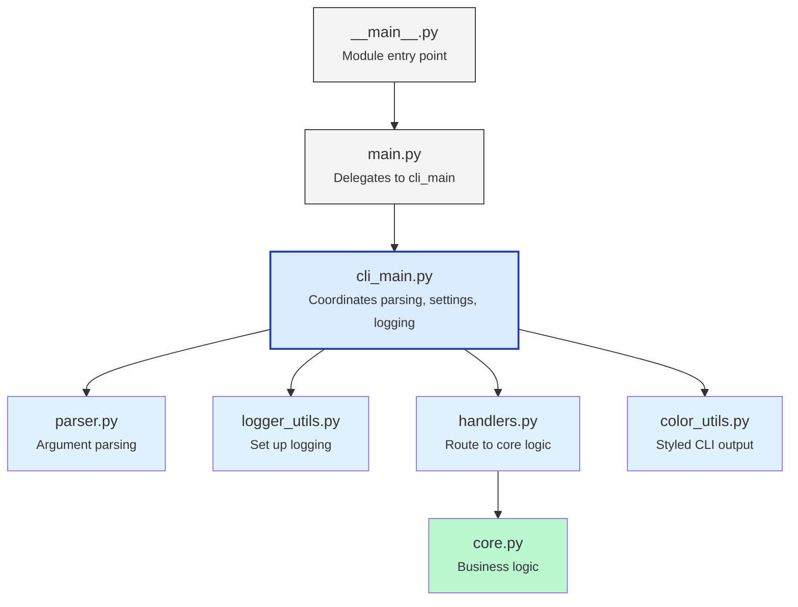

# 📦 CLI Architecture

This document describes the internal architecture of the `myproject` CLI, designed to be modular, testable, and robust. It also highlights key components and how they interact.


## 📚 Table of Contents

- [🧭 Overview](#-overview)
- [🗂️ File Structure](#-file-structure)
- [🚀 CLI Entry Flow](#-cli-entry-flow)
- [🧩 Argument Parsing (`parser.py`)](#-argument-parsing-parserpy)
- [🛣️ Handler Routing (`handlers.py`)](#-handler-routing-handlerspy)
- [🎨 Output Styling (`color_utils.py`)](#-output-styling-color_utilspy)
- [📝 Logging Setup (`logger_utils.py`)](#-logging-setup-logger_utilspy)
- [🧪 Testing the CLI](#-testing-the-cli)
- [✅ Summary](#-summary)
---

## 🧭 Overview

The CLI is structured around a layered model, separating parsing, logic, and output. Its entry point is the `myproject` command or `python -m myproject`, which triggers a well-organized flow of:

1. Environment loading
2. Argument parsing
3. Logging setup
4. Query processing
5. Output handling

---

## 🗂️ File Structure

```
src/myproject/
├── __main__.py            # Python entry point (calls main())
├── cli/
│   ├── __init__.py
│   ├── main.py            # CLI entry dispatcher
│   ├── cli_main.py        # Core CLI logic
│   ├── parser.py          # Argparse CLI parser
│   ├── handlers.py        # Routes to business logic
│   ├── color_utils.py     # Styled output (info, error, hint)
│   └── logger_utils.py    # Logging setup and teardown
```

---

## Diagram



---

## CLI Modules
### Entry Flow
#### 1. **`__main__.py`**

The CLI is executable via `python -m myproject`, which delegates to `cli.main()`.

```python
from myproject.cli import main
main()
```

#### 2. **`cli/main.py`**

This module initializes the CLI by calling `cli_main.main(argv)` and ensures the environment is loaded early.

```python
def main(argv: list[str] | None = None) -> None:
    cli_main.main(argv)
```


#### 3. 🧠 **`cli/cli_main.py`**

**🔹 Purpose**

* Central CLI logic hub. Coordinates settings, argument parsing, logging, and routing.

**🔹 Responsibilities**

* Apply early parsing to read `--env` or `--dotenv-path`
* Load and validate settings via `settings.py`
* Set up structured logging (`logger_utils.setup_logging`)
* Set CLI appearance (color, debug flags)
* Dispatch to `handlers.py` to process queries
* Format and return output (JSON or styled text)
* Exit with appropriate code

**🔹 Key Behavior**

* Supports `--verbose`, `--debug`, `--color`, and `--format`
* Logs are suppressed unless `--verbose` or `--debug` is used
* Uses `argcomplete.autocomplete()` if available (fallbacks if broken)
* Handles missing queries or malformed input with graceful exit
* Uses constants from `constants.py` for all exit codes


---

### 🧩 Argument Parsing (`parser.py`)

**🔹 Purpose**

* Provides argument parsing logic while supporting **early environment injection**.

**🔹 Components**

1. #### `apply_early_env(argv)`

   * Scans `argv` for `--env` or `--dotenv-path`
   * Pre-loads settings using `settings.load_settings()`
   * Returns minimal parser output with just early values

2. #### `create_parser(early: Namespace)`

   * Creates the full `argparse.ArgumentParser`
   * Includes logic for:

     * `--query`, `--env`, `--dotenv-path`
     * Output formatting flags: `--color`, `--format`, `--verbose`, `--debug`
     * Exit-related flags: `--help`, `--version`

**🔹 Extras**

* Replaces `error()` and `exit()` with custom logic to support better exit codes and logging
* Accepts pre-parsed early settings to inject default values
---

### 🛣️ Handler Routing (`handlers.py`)

**🔹 Purpose**

* Routes parsed CLI arguments to core logic or mock simulations

**🔹 Responsibilities**

* Calls `core.process_query()` if in normal mode
* Returns mocked data if `--env` is `test` or config is mocked
* Returns results in a dictionary structure to support both JSON and text output

**🔹 Design**

```python
def process_query_or_simulate(args, settings):
    if settings.environment == "TEST":
        return simulate_query(args.query)
    return core.process_query(args.query)
```

* Isolation of I/O and processing logic makes this highly testable.

---

### 🎨 Output Styling (`color_utils.py`)

**🔹 Purpose**

* Applies ANSI color codes to output
* Uses simple wrappers like `format_info()`, `format_error()`, `format_hint()`
* Honors the `--color` flag and auto-detection of terminal support

**🔹 Highlights**

* Color can be:

  * `auto`: Detect from `isatty()`
  * `always`: Force colors
  * `never`: Plain text only

* Prevents color bleed or malformed terminal prints in CI systems

### 📝 Logging Setup (`logger_utils.py`)

**🔹 Purpose**

* Sets up a per-environment logging system:

  * Log rotation
  * Timestamped log files
  * Colored console output when enabled

**🔹 Design**

* Logs go to `logs/{ENV}/myproject.log`
* Uses `RotatingFileHandler` with size limit from `.env`
* Appends or replaces existing handlers based on reset flag
* Suppresses logs unless `--verbose` or `--debug`

---

### 🧪 Testing the CLI

* CLI tests live under `tests/cli/`
* Integration tests simulate real `myproject` calls with subprocess
* Used `argparse.Namespace`
* Full integration coverage
* Log and environment patching via `conftest.py`
* `argcomplete` failure is tested by injecting a `argcomplete` stub module

---

## ✅ Summary

The CLI is fully decoupled from the core logic and settings loader. It supports rich features like color, verbosity, JSON/text formatting, autocomplete, and robust exit handling. This separation improves maintainability and enables full test coverage with both direct unit tests and subprocess integration tests.
